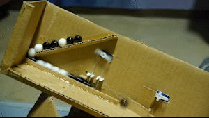

# Marble Sorting Robot
---


**Difficulty: Fairly difficult. Construction required.**

**Objective: Servo control / simple robotics.**

**Note: This project requires two positional servo motors and two pushbuttons. More details are found at the bottom of this page.**

[](https://www.youtube.com/watch?v=MuRkU2dR5Cc)

## How it Works
The BrainPad is programmed to separate black and white marbles using the light sensor, two servo motors, and two pushbuttons. The first button is used to calibrate the light sensor for the current lighting. To calibrate you must place ten marbles in the machine starting with a black marble and alternating in color. Pressing the first button will then start the calibration. The second button is used to start sorting marbles which are placed in the machine in random order.

## The Code in C#
> [!Tip]
> Make sure the namespace in your program matches your project's namespace.  Your project's namespace can be found in the BrainPad Helper file by clicking on the BrainPad1.cs tab.  [**More Info**](../go-beyond/csharp/intro.md#a-few-words-about-namespaces).

```
using GHIElectronics.TinyCLR.Devices.Gpio;

namespace ModifyThis {
    class Program {
        static int threshold;

        // Servo1 is marble release.  73 degrees lets marble in for scanning.
        const double ServoOneLoad = 73;

        // 117 degrees releases marble and blocks next one.
        const double ServoOneRelease = 117;

        // Servo2 is deflector.  80 degrees lifts deflector allowing marble underneath.
        const double ServoTwoUp = 80;

        // 127 degrees lowers and deflects marble.
        const double ServoTwoDown = 127;

        // Amount of time to let servo motors finish moving (in milliseconds).
        const double WaitTime = 180;

        static void Main() {
            GpioController GPIO = GpioController.GetDefault();
            GpioPin redButton = GPIO.OpenPin(GHIElectronics.TinyCLR.Pins.BrainPad.Expansion.GpioPin.Pwm);
            redButton.SetDriveMode(GpioPinDriveMode.InputPullUp);

            GpioPin yellowButton = GPIO.OpenPin(GHIElectronics.TinyCLR.Pins.BrainPad.Expansion.GpioPin.Int);
            yellowButton.SetDriveMode(GpioPinDriveMode.InputPullUp);

            BrainPad.ServoMotors.ServoOne.ConfigureAsPositional(false);
            BrainPad.ServoMotors.ServoOne.ConfigurePulseParameters(0.5, 2.5);
            BrainPad.ServoMotors.ServoOne.Set(ServoOneRelease);

            BrainPad.ServoMotors.ServoTwo.ConfigureAsPositional(false);
            BrainPad.ServoMotors.ServoTwo.ConfigurePulseParameters(0.5, 2.5);
            BrainPad.ServoMotors.ServoTwo.Set(ServoTwoDown);

            while (true) {
                if (redButton.Read() == GpioPinValue.Low) {
                    // Calibrate mode.  Load 10 marbles black white black white . . .
                    int highestBlackLevel = 0;
                    int lowestWhiteLevel = 100;

                    for (int marblePair = 0; marblePair < 5; marblePair++) {
                        int currentLightLevel = ReadMarble();
                        if (currentLightLevel > highestBlackLevel) highestBlackLevel = currentLightLevel;
                        ReleaseMarble(false);

                        currentLightLevel = ReadMarble();
                        if (currentLightLevel < lowestWhiteLevel) lowestWhiteLevel = currentLightLevel;
                        ReleaseMarble(false);
                    }
                    threshold = (lowestWhiteLevel + highestBlackLevel) >> 1;
                }

                if (yellowButton.Read() == GpioPinValue.Low) {
                    // Sort mode.  Load with 19 marbles.
                    for (int marbleNumber = 0; marbleNumber < 19; marbleNumber++) {
                        ReleaseMarble(ReadMarble() > threshold);
                    }
                }
            }
        }

        static int ReadMarble() {
            BrainPad.ServoMotors.ServoOne.Set(ServoOneLoad);
            BrainPad.Wait.Milliseconds(WaitTime);
            return BrainPad.LightSensor.ReadLightLevel();
        }

        static void ReleaseMarble(bool up) {
            if (up) BrainPad.ServoMotors.ServoTwo.Set(ServoTwoUp);
            else BrainPad.ServoMotors.ServoTwo.Set(ServoTwoDown);

            BrainPad.ServoMotors.ServoOne.Set(ServoOneRelease);
            BrainPad.Wait.Milliseconds(WaitTime);
        }
    }
}

```

## Construction

The red button is used to start the calibration procedure and is connected between the PWM pin and the GND pin on the BrainPad's expansion header. The yellow button is used to start sorting marbles and is connected between the INT and GND pins on the expansion header.

The two servo motors are ordinary SG90 micro servos. They are available online for about two dollars (US) each. You should be able to find several sources for these servos by searching for "SG90 micro servo."

Servo motor one moves two paperclips up and down in opposite directions to release one marble while blocking the next marble. Each marble is held in front of the BrainPad's light sensor so it can be determined if it is a black or white marble. The BrainPad is mounted on the back of the box. A hole is cut in the box so the light sensor can peek through the hole and "see" each marble.

Servo motor two moves a cardboard deflector which determines which of two paths each marble will take. When the deflector is in the up position the marble can go underneath it where it falls through a hole in the corner of the box. When the deflector is down the marble is guided to a hole in the opposite corner of the box.

The entire assembly is hot glued to another box at an angle which allows the marbles to be gravity fed. The box is also tilted in a manner such that the undeflected marbles will move toward a hole in one corner of the box, while the deflected marbles will roll toward the other corner.